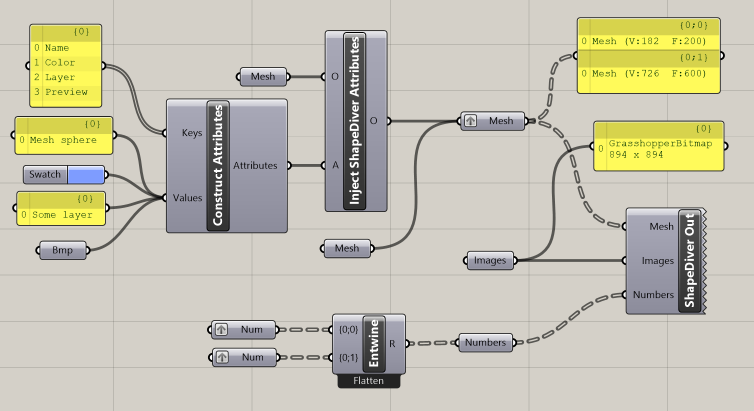
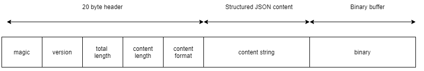

The Structured Data Transfer Format (sdTF) is an API-neutral exchange and storage format for trees of data items as used by parametric 3D modeling software like [Grasshopper®](https://www.grasshopper3d.com/).

Last Updated: March 17, 2021

Editors

  * Alexander Schiftner, [ShapeDiver](https://www.shapediver.com)
  * Emil Poulsen, [CORE studio](http://core.thorntontomasetti.com/)
  * Matthias Reisacher, [ShapeDiver](https://www.shapediver.com)

Copyright (C) 2020-2021 ShapeDiver GmbH. All Rights Reserved.

# Contents

* [Introduction](#introduction)
  * [Motivation](#motivation)
  * [Basics](#basics)
  * [Design goals](#design-goals)
  * [Versioning](#versioning)
  * [File extensions and MIME types](#file-extensions-and-mime-types)
* [Concepts](#concepts)
  * [Asset](#asset)
  * [Nodes](#nodes)
  * [Chunks](#chunks)
  * [Data items](#data-items)
  * [Buffers](#buffers)
  * [Bufferviews](#bufferviews)
  * [Accessors](#accessors)
  * [Attributes](#attributes)
  * [Type hints](#type-hints)
* [A complete example](#a-complete-example)
* [Binary sdTF file format specification](#binary-sdtf-file-format-specification)
   * [Magic](#binary-sdtf-magic)
   * [Version](#binary-sdtf-version)
   * [Total length](#binary-sdtf-total-length)
   * [Content length](#binary-sdtf-content-length)
   * [Content format](#binary-sdtf-content-format)
   * [Content string](#binary-sdtf-content-string)
   * [Binary](#binary-sdtf-binary)
* [Properties reference](#properties-reference)
  * [accessor](#reference-accessor)
  * [attributes](#reference-attributes)
  * [attributevalue](reference-attributevalue)
  * [buffer](#reference-buffer)
  * [bufferview](#reference-bufferview)
  * [chunk](#reference-chunk)
  * [fileinfo](#reference-fileinfo)
  * [item](#reference-item)
  * [node](#reference-node)
  * [sdTF (root object)](#reference-sdTF)
  * [typehint](#reference-typehint)


# Introduction

sdTF makes it possible to store and exchange trees of data items as used by parametric 3D modelling software in an efficient and extensible way, independent of software vendors. 

## Motivation

Chaining applications based on parametric 3D modelling requires an open, efficient, and easily extensible data format for exchange of complex data structures. sdTF aims to close this gap. 

## Basics

sdTF stores data items like primitives, 3D objects, images, PDF documents, as well as metadata about them: 

  * the tree structure used to organize data items
  * optional attributes attached to data items

The metadata is stored in JSON format, while data items may either be embedded into the metadata (typically used for primitive data items), or stored in binary buffers which are referenced from the metadata (3D objects, images, documents, arrays of numbers, other blobs). Metadata and binary buffers may either be kept in separate files, or merged into a single [_binary sdTF_](#binary-sdtf-file-format-specification). 

## Design goals

sdTF has been designed with the following goals in mind: 

  * _Lazy loading, separate fetching of metadata and data items_: sdTF allows for the metadata to be fetched and inspected without loading binary data. Fetching of individual data items is possible using HTTP range requests, without downloading a complete asset. 
  * _Independence from specific runtimes_: sdTF does not depend on closed source libraries.
  * _Extensibility_: The sdTF asset format specification is openly available and allows for extensions in many ways. As an example support for further formats for serialisation of data items can easily be added. The specification itself allows for extensions while keeping backwards compatibility. 

## Versioning

Any updates made to sdTF in a minor version will be backwards and forwards compatible. Backwards compatibility will ensure that any client implementation that supports loading a sdTF 1.x asset will also be able to load a sdTF 1.0 asset. Forwards compatibility will allow a client implementation that only supports sdTF 1.0 to load sdTF 1.x assets while gracefully ignoring any new features it does not understand.

A minor version update can introduce new features but will not change any previously existing behavior. Existing functionality can be deprecated in a minor version update, but it will not be removed.

Major version updates are not expected to be compatible with previous versions.

## File extensions and MIME types

  * `*.sdtf` for _binary sdTF_, MIME type `model/vnd.sdtf`
  * `*.jsdtf` for JSON sdTF (metadata only), MIME type `model/vnd.sdtf+json`
  * `*.bin` for binary buffers referenced from metadata, MIME type `application/octet-stream`

# Concepts

sdTF metadata is stored in JSON format. This section describes the concepts used for the properties representing the metadata in JSON. A flat hierarchy is used, using numeric indices for refering between child items of top level attributes. 

## Asset

This property must exist in any sdTF. It contains information about versioning, and optional information about the author and copyright. 

### Example: minimal sdTF

```
{
  "asset": {
    "generator": "ShapeDiverSdtfWriter",
    "copyright": "Author of sdTF asset",
    "version": "1.0"
  }
}
```

## Nodes

Trees in sdTF are made of nodes. Nodes can reference other `nodes` and/or data `items`. They can have an optional `name`, optional `attributes`, and an optional `typeHint`. 
Due to the flat hierarchy it's theoretically possible to create circular structures of nodes, but that's discouraged. 

### Example: Node referencing data items

A node element of the [type](#reference-typehint) specified at typeHint[2], consisting of 13 elements.

```
{
  "name": "[0,0]",
  "items": [3, 4, 4, 5, 6, 7, 8, 9, 10, 11, 12, 13, 14],
  "typeHint": 2
}
```

### Example: Node referencing other nodes

A node element of the [type](#reference-typehint) specified at typeHint[0], referencing [nodes](#reference-node) that are defined at nodes[0] and nodes[1].

```
{
  "name": "57e60008-ee18-4864-8711-1cbc8adfc821",
  "nodes": [0, 1],
  "typeHint": 0,
  "attributes": 1
}
```

## Chunks

Chunks use the same schema as nodes, the only difference being that they provide the entry points to the sdTF. 
Typically every chunk corresponds to a separate tree structure. 

Example: In case we are storing several Grasshopper data trees in a sdTF, each data tree becomes a chunk. 
The first level of nodes below a chunk corresponds to the branches of the tree. Each such node references a list of data items.

## Data items

Data items serve as the leaves of trees defined by nodes. The actual data may be embedded directly, or a reference to an accessor. Data items can have optional attributes.

### Example: Item embedding a value

```
{
  "value": 42.0,
  "typeHint": 2
}
```

### Example: Item referencing an accessor

An item representing some binary data, that is stored inside of a [buffer](#reference-buffer), by referencing an [accessor](#reference-accessor) element.

```
{
  "accessor": 0,
  "typeHint": 0
}
```

## Buffers

Buffers are used to story binary data, imagine them as a concatenation of individual files (in fact: bufferviews). A single sdTF can reference multiple buffers. The actual data of a buffer can reside

  * in a external binary file referenced by an uri, 
  * embedded into the JSON metadata by means of a data uri, or
  * appended directly to the JSON metadata in case of a [_binary sdTF_](#binary-sdtf-file-format-specification).

### Example: External buffer

Uris to external buffers are resolved relative, absolute uris can be used but are discouraged.

```
{
  "byteLength": 1234,
  "uri": "buffer.bin"
}
```

<a name="example-attached-buffer-binary-sdtf"></a>
### Example: Attached buffer (binary sdTF)

In case of binary sdTF the first buffer in the list refers to the directly attached one, hence it only uses the `byteLength` property.

```
{
  "byteLength": 2358119
}
```

## Bufferviews

A bufferview is a pointer to a portion of a buffer, it references a file or simply some binary data (e.g. a large list of numbers, or a large string). 
The `byteOffset` and `byteLength` define the location of the bufferview inside the buffer. 

### Example: Bufferview for a 3dm file

```
{
  "buffer": 0,
  "byteOffset": 0,
  "byteLength": 5164,
  "contentType": "model/vnd.3dm",
  "contentEncoding": "gzip"
}
```

### Example: Image

The accessor references a complete bufferview (in this case an image file).

```
{
  "bufferView": 0
}
```

### Example: Bufferview for an image file

```
{
  "buffer": 0,
  "byteOffset": 0,
  "byteLength": 2073,
  "contentType": "image/png"
}
```

## Accessors

Accessors reference individual objects inside bufferviews. What they are referencing depends on the type of bufferview. In some cases they reference a complete bufferview.

### Example: Geometric object in a 3dm file

Referencing an individual object located in [bufferViews[0]](#reference-buffer) via its id.

```
{
  "bufferView": 0,
  "id": "64b723b9-2712-4f4e-a7ef-9c34cbf68289"
}
```

## Attributes

Attributes are stored as dictionaries. They can be referenced by nodes, chunks, and data items. Attribute values can be directly embedded, or reference accessors. 

### Example

```
{
  "Name": {
    "value": "Mesh sphere",
    "typeHint": 3
  },
  "Color": {
    "value": "126, 156, 255",
    "typeHint": 4
  },
  "Layer": {
    "value": "Some layer",
    "typeHint": 3
  },
  "Preview": {
    "accessor": 3,
    "typeHint": 1
  }
}
```

## Type hints

Type hints are used to add information about the type of data items found below a specific node in the tree. They are also used for data items, allowing to know 
about the type without reading binary data. 

### Example

```
{
  "typeHints": [{
    "name": "rhino.mesh"
  }, {
    "name": "image"
  }, {
    "name": "double"
  }, {
    "name": "string"
  }, {
    "name": "color"
  }, {
    "name": "guid"
  }]
}
```
# A complete example

The following example shows the metadata of an sdTF asset containing 3 trees: 

  * a tree called _Mesh_ containing two branches with one mesh each (one of the meshes has attributes attached)
  * a tree called _Images_ containing a single branch with a single image
  * a tree called _Numbers_ containing two branches which are lists of numbers

<p align="center">

</p>

You can download [the complete binary sdTF asset](assets/sdTF_spec_example.sdtf) and the [Grasshopper model that was used to create it (requires ShapeDiver plugin >= 2.0)](assets/sdTF_spec_example.ghx).

```
{
  "asset": {
    "generator": "ShapeDiverSdtfWriter",
    "version": "1.0"
  },
  "chunks": [
    {
      "attributes": 1,
      "name": "57e60008-ee18-4864-8711-1cbc8adfc821",
      "nodes": [ 0, 1 ],
      "typeHint": 0
    },
    {
      "attributes": 2,
      "name": "c641e0f8-ecfd-4607-936f-01ed06ac7dbd",
      "nodes": [ 2 ],
      "typeHint": 1
    },
    {
      "attributes": 3,
      "name": "fc5cedb5-42c0-4238-ae01-9cf94d194130",
      "nodes": [ 3, 4 ],
      "typeHint": 2
    }
  ],
  "nodes": [
    {
      "items": [ 0 ],
      "name": "[0,0]",
      "typeHint": 0
    },
    {
      "items": [ 1 ],
      "name": "[0,1]",
      "typeHint": 0
    },
    {
      "items": [ 2 ],
      "name": "[0]",
      "typeHint": 1
    },
    {
      "items": [ 3, 4, 4, 5, 6, 7, 8, 9, 10, 11, 12, 13, 14 ],
      "name": "[0,0]",
      "typeHint": 2
    },
    {
      "items": [ 4, 5, 6, 7, 15, 16, 9, 17, 18, 19, 20 ],
      "name": "[0,1]",
      "typeHint": 2
    }
  ],
  "items": [
    {
      "accessor": 0,
      "attributes": 0,
      "typeHint": 0
    },
    {
      "accessor": 1,
      "typeHint": 0
    },
    {
      "accessor": 2,
      "typeHint": 1
    },
    {
      "typeHint": 2,
      "value": 0
    },
    {
      "typeHint": 2,
      "value": 1
    },
    {
      "typeHint": 2,
      "value": 2
    },
    {
      "typeHint": 2,
      "value": 3
    },
    {
      "typeHint": 2,
      "value": 5
    },
    {
      "typeHint": 2,
      "value": 8
    },
    {
      "typeHint": 2,
      "value": 13
    },
    {
      "typeHint": 2,
      "value": 21
    },
    {
      "typeHint": 2,
      "value": 34
    },
    {
      "typeHint": 2,
      "value": 55
    },
    {
      "typeHint": 2,
      "value": 89
    },
    {
      "typeHint": 2,
      "value": 144
    },
    {
      "typeHint": 2,
      "value": 7
    },
    {
      "typeHint": 2,
      "value": 11
    },
    {
      "typeHint": 2,
      "value": 17
    },
    {
      "typeHint": 2,
      "value": 19
    },
    {
      "typeHint": 2,
      "value": 23
    },
    {
      "typeHint": 2,
      "value": 27
    }
  ],
  "attributes": [
    {
      "Name": {
        "typeHint": 3,
        "value": "Mesh sphere"
      },
      "Color": {
        "typeHint": 4,
        "value": "126, 156, 255"
      },
      "Layer": {
        "typeHint": 3,
        "value": "Some layer"
      },
      "Preview": {
        "accessor": 3,
        "typeHint": 1
      }
    },
    {
      "Id": {
        "typeHint": 5,
        "value": "57e60008-ee18-4864-8711-1cbc8adfc821"
      },
      "Name": {
        "typeHint": 3,
        "value": "Mesh"
      },
      "Type": {
        "typeHint": 3,
        "value": "Mesh"
      }
    },
    {
      "Id": {
        "typeHint": 5,
        "value": "c641e0f8-ecfd-4607-936f-01ed06ac7dbd"
      },
      "Name": {
        "typeHint": 3,
        "value": "Images"
      },
      "Type": {
        "typeHint": 3,
        "value": "GrasshopperBitmap"
      }
    },
    {
      "Id": {
        "typeHint": 5,
        "value": "fc5cedb5-42c0-4238-ae01-9cf94d194130"
      },
      "Name": {
        "typeHint": 3,
        "value": "Numbers"
      },
      "Type": {
        "typeHint": 3,
        "value": "Number"
      }
    }
  ],
  "typeHints": [
    {
      "name": "rhino.mesh"
    },
    {
      "name": "image"
    },
    {
      "name": "double"
    },
    {
      "name": "string"
    },
    {
      "name": "color"
    },
    {
      "name": "guid"
    }
  ],
  "accessors": [
    {
      "bufferView": 0,
      "id": "d16103f1-f64f-4dd6-9d87-924520d554cd"
    },
    {
      "bufferView": 0,
      "id": "e2bb8f80-5df3-41a4-b6ad-ce5e71f2bd06"
    },
    {
      "bufferView": 1
    },
    {
      "bufferView": 2
    }
  ],
  "bufferViews": [
    {
      "buffer": 0,
      "byteLength": 11590,
      "byteOffset": 0,
      "contentEncoding": "gzip",
      "contentType": "model/vnd.3dm"
    },
    {
      "buffer": 0,
      "byteLength": 2172131,
      "byteOffset": 11592,
      "contentType": "image/png"
    },
    {
      "buffer": 0,
      "byteLength": 173507,
      "byteOffset": 2183724,
      "contentType": "image/png"
    }
  ],
  "buffers": [
    {
      "byteLength": 2357231
    }
  ]
}

```


# Binary sdTF file format specification

The binary sdTF file consists of three parts:

- a 20 byte long binary header describing the contents of the binary sdTF file (little endian).
- a content string: the metadata as described in section [Concepts](#concepts).
- a binary blob attached at the end of the file, containing the data of the first buffer referenced from the metadata (see [Example: Attached buffer (binary sdTF)](#example-attached-buffer-binary-sdtf)).

See section [A complete example](#a-complete-example) to download a sample binary sdTF file, and see below for a diagram and descriptions of the individual parts.

  
_Visual representation of the different parts of the sdTF file_

The following sections describe each part in more detail.

<a name="binary-sdtf-magic"></a>
### Magic
A 4 byte ASCII encoded string “sdTF“ representing an identifier of the binary sdTF file type. It can be used to identify a file as binary sdTF.

<a name="binary-sdtf-version"></a>
### Version
 A 4 byte uint indicating the version of the binary sdTF format (currently 1). This version is relevant for the binary format and how to deconstruct the other parts.

<a name="binary-sdtf-total-length"></a>
 ### Total length
A 4 byte uint representing the total length of the binary sdTF file.

<a name="binary-sdtf-content-length"></a>
 ### Content length
A 4 byte int representing the total length of the content string.

<a name="binary-sdtf-content-format"></a>
 ### Content format
A 4 byte uint indicating an identifier for the content string format. 0 for JSON.

<a name="binary-sdtf-content-string"></a>
 ### Content string
 A string of arbitrary length describing the metadata of the sdTF asset. In the case of JSON (i.e. if the [content format](#binary-sdtf-content-format) indicates 0), this will be UTF8 encoded. See section [Concepts](#concepts) for detailed information and section [A complete example](#a-complete-example) to see an example json.

<a name="binary-sdtf-binary"></a>
 ### Binary
 Contains the data of the first buffer referenced from the metadata (see [Example: Attached buffer (binary sdTF)](#example-attached-buffer-binary-sdtf)).

# Properties reference

* [accessor](#reference-accessor)
* [attributes](#reference-attributes)
* [attributevalue](#reference-attributevalue)
* [buffer](#reference-buffer)
* [bufferview](#reference-bufferview)
* [chunk](#reference-chunk)
* [fileinfo](#reference-fileinfo)
* [item](#reference-item)
* [node](#reference-node)
* [sdTF (root object)](#reference-sdTF)
* [typehint](#reference-typehint)


---------------------------------------
<a name="reference-accessor"></a>
### accessor

Accessors reference individual objects inside bufferviews. What they are referencing depends on the type of bufferview. In some cases they reference a complete bufferview. 

**Properties**

|   |Type|Description|Required|
|---|----|-----------|--------|
|**bufferView**|`integer`|Id of the referenced bufferview.|:white_check_mark: Yes|
|**id**|`string`|Id of the referenced object inside the bufferview.|No|

Additional properties are allowed.

#### accessor.bufferView :white_check_mark:

Id of the referenced bufferview.

* **Type**: `integer`
* **Required**: Yes
* **Minimum**: ` >= 0`

#### accessor.id

Id of the referenced object inside the bufferview. Used to reference individual objects in files that contain multiple objects. 
The meaning of this id is specific to the content type of the bufferview (the file type).
May be omitted in case the complete bufferview shall be referenced, e.g. in case of image files. 

* **Type**: `string`
* **Required**: No


---------------------------------------
<a name="reference-attributes"></a>
### attributes

Attributes are stored as dictionaries, mapping an arbitrary number of attribute names to their values, where the values are represented as [attributevalue](#reference-attributevalue). 

**Properties**

|   |Type|Description|Required|
|---|----|-----------|--------|
|name of attribute as `string`|[`attributevalue`](#reference-attributevalue)|An [`attributevalue`](#reference-attributevalue) object, representing the attribute's value.|No|

Each property of an `attributes` object corresponds to a key-value pair, further properties are not allowed.


---------------------------------------
<a name="reference-attributevalue"></a>
### attributevalue

Attribute values are very similar to [items](#reference-item), except that they can not reference attributes.

**Properties**

|   |Type|Description|Required|
|---|----|-----------|--------|
|**accessor**|`integer`|Index to referenced accessor.|No|
|**typeHint**|`integer`|Index to referenced typehint.|:white_check_mark: Yes|
|**value**|`any`|Embedded value.|No|

Additional properties are allowed.

#### attributevalue.accessor

Index to referenced accessor. Both an embedded value and an accessor may be specified, in which case the embedded value serves as preview.

* **Type**: `integer`
* **Required**: No
* **Minimum**: ` >= 0`

#### attributevalue.typeHint

Index to referenced typehint.

* **Type**: `integer`
* **Required**: Yes

#### attributevalue.value

Embedded value.

* **Type**: `any`
* **Required**: No


---------------------------------------
<a name="reference-buffer"></a>
### buffer

A buffer is used to reference binary data. 

**Properties**

|   |Type|Description|Required|
|---|----|-----------|--------|
|**byteLength**|`integer`|Length of the buffer in bytes.|:white_check_mark: Yes|
|**uri**|`string`|Uri to fetch buffer from.|No|

Additional properties are allowed.

#### buffer.byteLength :white_check_mark:

Length of the buffer in bytes.

* **Type**: `integer`
* **Required**: Yes
* **Minimum**: ` >= 0`

#### buffer.uri

Uri to fetch data from. Can be a data uri. Not set in case of the directly attached buffer used for _binary sdTF_.

* **Type**: `string`
* **Required**: No


---------------------------------------
<a name="reference-bufferview"></a>
### bufferview

A bufferview references a chunk of data in a buffer.

**Properties**

|   |Type|Description|Required|
|---|----|-----------|--------|
|**buffer**|`integer`|Index of the referenced buffer.|:white_check_mark: Yes|
|**byteLength**|`integer`|Length of the bufferView in bytes.|:white_check_mark: Yes|
|**byteOffset**|`integer`|Offset into the buffer in bytes.|:white_check_mark: Yes|
|**contentEncoding**|`string`|Content-Encoding which was used to compress the data referenced by the buffer view.|No|
|**contentType**|`string`|MIME type of data referenced by the buffer view.|:white_check_mark: Yes|
|**name**|`string`|Optional name of the buffer view.|No|

Additional properties are allowed.

#### bufferview.buffer :white_check_mark:

Index of the referenced buffer (0-based).

* **Type**: `integer`
* **Required**: Yes
* **Minimum**: ` >= 0`

#### bufferview.byteLength :white_check_mark:

Length of the bufferView in bytes.

* **Type**: `integer`
* **Required**: Yes
* **Minimum**: ` >= 0`

#### bufferview.byteOffset :white_check_mark:

Offset into the buffer in bytes.

* **Type**: `integer`
* **Required**: Yes
* **Minimum**: ` >= 0`

#### bufferview.contentEncoding

Content-Encoding which was used to compress the data referenced by the buffer view. 
See [https://developer.mozilla.org/en-US/docs/Web/HTTP/Headers/Content-Encoding](https://developer.mozilla.org/en-US/docs/Web/HTTP/Headers/Content-Encoding).

* **Type**: `string`
* **Required**: No

#### bufferview.contentType :white_check_mark:

MIME type of data referenced by the buffer view.
See [https://www.iana.org/assignments/media-types/media-types.xhtml](https://www.iana.org/assignments/media-types/media-types.xhtml)
and [https://tools.ietf.org/html/rfc6838](https://tools.ietf.org/html/rfc6838)

* **Type**: `string`
* **Required**: Yes

#### bufferview.name

Optional name of the buffer view

* **Type**: `string`
* **Required**: No


---------------------------------------
<a name="reference-chunk"></a>
### chunk

Same as [node](#reference-node). 


---------------------------------------
<a name="reference-fileinfo"></a>
### fileinfo

Metadata about the sdTF asset. 

**Properties**

|   |Type|Description|Required|
|---|----|-----------|--------|
|**copyright**|`string`|Copyright mark.|No|
|**generator**|`string`|Hint to software package that generated the sdTF asset.|No|
|**version**|`string`|The sdTF version used by this asset.|:white_check_mark: Yes|

Additional properties are allowed.


---------------------------------------
<a name="reference-item"></a>
### item

Data items serve as the leaves of trees defined by nodes. The actual data may be embedded directly, or a reference to an accessor. Data items can have optional attributes. 

**Properties**

|   |Type|Description|Required|
|---|----|-----------|--------|
|**accessor**|`integer`|Index to referenced accessor.|No|
|**attributes**|`integer`|Index to referenced attributes.|No|
|**typeHint**|`integer`|Index to referenced typehint.|:white_check_mark: Yes|
|**value**|`any`|Embedded value.|No|

Additional properties are allowed.

#### item.accessor

Index to referenced accessor. Both an embedded value and an accessor may be specified, in which case the embedded value serves as preview.

* **Type**: `integer`
* **Required**: No
* **Minimum**: ` >= 0`

#### item.attributes

Index to referenced attributes.

* **Type**: `integer`
* **Required**: No

#### item.typeHint

Index to referenced typehint.

* **Type**: `integer`
* **Required**: Yes

#### item.value

Embedded value.

* **Type**: `any`
* **Required**: No


---------------------------------------
<a name="reference-node"></a>
### node

Trees in sdTF are made of nodes. Nodes can reference other nodes and/or data items. 

**Properties**

|   |Type|Description|Required|
|---|----|-----------|--------|
|**attributes**|`integer`|Index to referenced attributes.|No|
|**items**|`integer[]`|Array of indices of child items.|No|
|**name**|`string`|Optional name of node.|No|
|**nodes**|`integer[]`|Array of indices of child nodes.|No|
|**typeHint**|`integer`|Index to referenced typehint.|No|

Additional properties are allowed.

#### node.attributes

Index to referenced attributes.

* **Type**: `integer`
* **Required**: No

#### node.items

Array of indices of child items.

* **Type**: `integer[]`
* **Required**: No

#### node.name

Optional name of node.

* **Type**: `string`
* **Required**: No

#### node.nodes

Array of indices of child nodes. **Must not** reference itself.

* **Type**: `integer[]`
* **Required**: No

#### node.typeHint

Index to referenced typehint. **Should** be specified in case the type hint for all child nodes and items is the same. **Must not** be specified otherwise.

* **Type**: `integer`
* **Required**: No


---------------------------------------
<a name="reference-sdTF"></a>
### sdTF (root object)

The root object of an sdTF asset.

**Properties**

|   |Type|Description|Required|
|---|----|-----------|--------|
|**accessors**|[`accessor[]`](#reference-accessor)|Array of accessors.|No|
|**asset**|[`fileinfo`](#reference-fileinfo)|Metadata about the asset.|:white_check_mark: Yes|
|**attributes**|[`attributes[]`](#reference-attributes)|Array of attributes.|No|
|**buffers**|[`buffer[]`](#reference-buffer)|Array of buffers.|No|
|**bufferViews**|[`bufferView[]`](#reference-bufferView)|Array of bufferviews.|No|
|**chunks**|[`chunk[]`](#reference-chunk)|Array of chunks.|No|
|**items**|[`item[]`](#reference-item)|Array of items.|No|
|**nodes**|[`node[]`](#reference-node)|Array of nodes.|No|
|**typeHints**|[`typeHint[]`](#reference-typeHint)|Array of type hints.|No|

Additional properties are allowed.


---------------------------------------
<a name="reference-typehint"></a>
### typehint

Type hints are used to add information about the type of data items found below a specific node in the tree. 

**Properties**

|   |Type|Description|Required|
|---|----|-----------|--------|
|**name**|`string`|Name of the typehint.|:white_check_mark: Yes|

Additional properties are allowed.

#### typehint.name :white_check_mark:

Name of the typehint

* **Type**: `string`
* **Required**: Yes
* **Supported values** (extensible):
  * boolean
  * char
  * color
  * data
  * decimal
  * double
  * guid
  * image
  * int8
  * int16
  * int32
  * int64
  * json
  * single
  * string
  * uint8
  * uint16
  * uint32
  * uint64
  * geometry.arc
  * geometry.boundingbox
  * geometry.box
  * geometry.circle
  * geometry.complex
  * geometry.cone
  * geometry.cylinder
  * geometry.ellipse
  * geometry.interval
  * geometry.interval2
  * geometry.line
  * geometry.matrix
  * geometry.plane
  * geometry.point
  * geometry.point2d
  * geometry.point3d
  * geometry.point4d
  * geometry.polyline
  * geometry.ray
  * geometry.rectangle
  * geometry.sphere
  * geometry.torus
  * geometry.transform
  * geometry.transformlist
  * geometry.vector
  * geometry.vector2d
  * geometry.vector3d
  * geometry.vector4d
  * grasshopper.path
  * rhino.arccurve
  * rhino.brep
  * rhino.curve
  * rhino.extrusion
  * rhino.linecurve
  * rhino.mesh
  * rhino.nurbscurve
  * rhino.nurbssurface
  * rhino.planesurface
  * rhino.point
  * rhino.polycurve
  * rhino.polylinecurve
  * rhino.revsurface
  * rhino.subd
  * rhino.surface
